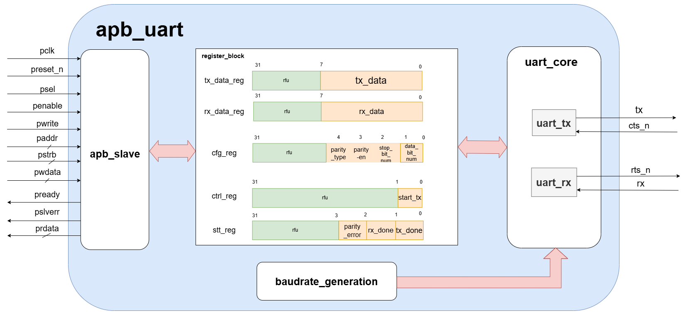
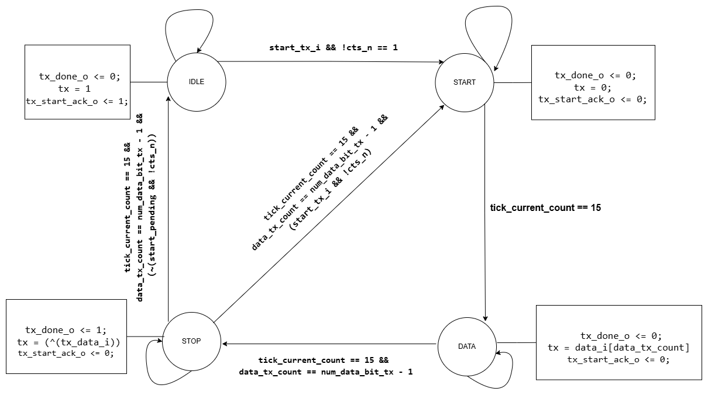
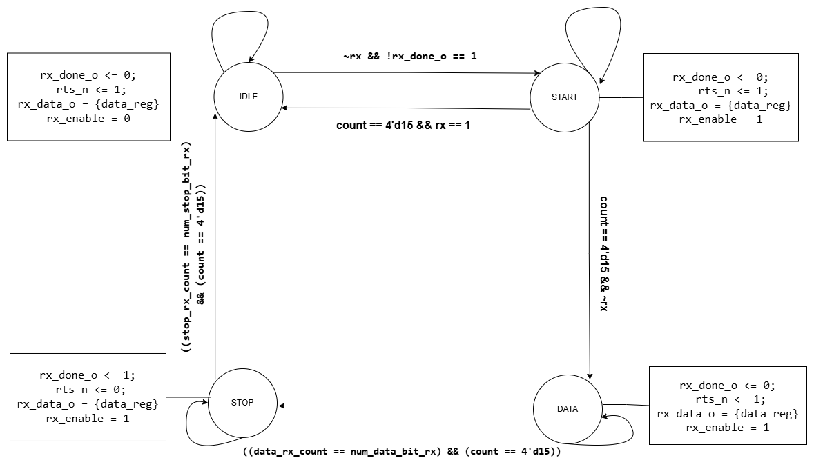
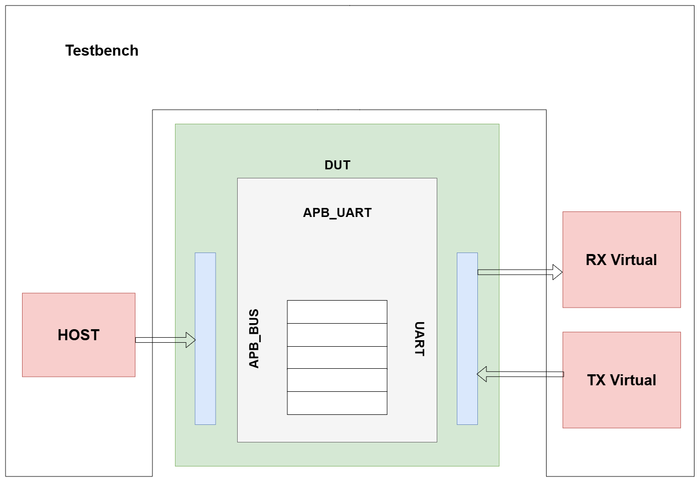

# APB UART IP Core

This repository contains a hardware design and simulation environment for an **APB (Advanced Peripheral Bus)** to **UART (Universal Asynchronous Receiver-Transmitter)** protocol bridge, implemented in **SystemVerilog**.

---

## 📌 Key Features

- **AMBA APB Interface:** Fully compliant APB Slave interface with a 32-bit data bus and a 12-bit address bus.
- **Configurable UART Settings:**
  - **Baudrate:** Configurable via parameters (default is 115200 bps with a 50MHz system clock).
  - **Data Bit Width:** Supports 5, 6, 7, or 8 data bits.
  - **Stop Bits:** Supports 1 or 2 stop bits.
  - **Parity Bit:** Optional parity check (Even, Odd Parity) or No Parity (Disabled).
- **Hardware Flow Control:** Supported via `rts_n` (Ready to Send) and `cts_n` (Clear to Send) handshake signals.
- **Error Detection:** Automated parity error detection.
- **Status & Control:** Transmission/reception status flags and control register for initiating transmissions.

---

## 📐 Architecture

The block diagram below displays the high-level architecture of the APB UART IP core, demonstrating the connections between the main submodules:



The design is modularized into the following key submodules:
1. **`apb_slave.sv`**: Handles direct communication with the CPU/Host APB bus. Translates APB read/write cycles into internal register read/write commands.
2. **`register_block.sv`**: Manages configuration, status, control registers, and buffers for transmit/receive data.
3. **`uart_core.sv`**: Integrates the transmitter and receiver modules:
   - **`uart_tx.sv`**: Converts parallel data from the transmission register into a serial bitstream on the `tx` line.
   - **`uart_rx.sv`**: Samples the incoming serial data on the `rx` line to reconstruct the parallel data and verify integrity.
4. **`baudrate_generator.sv`**: Generates sampling ticks (`tx_tick` and `rx_tick`) based on the system clock frequency and the targeted baudrate.

---

## 🗃️ Register Map

All registers in the system are **32-bit** wide and byte-addressable relative to the APB base address:

| Register Name | Offset Address | Access Type | Description |
| :--- | :--- | :--- | :--- |
| **TX_DATA_REG** | `0x00` | R/W | **Transmit Data Register**: Write data to be transmitted here (only the lower bits are used, depending on config). |
| **RX_DATA_REG** | `0x04` | R-Only | **Receive Data Register**: Holds the received data. Reading this register automatically clears the `rx_done` status flag and releases `rts_n`. |
| **CFG_REG** | `0x08` | R/W | **Configuration Register**: Configures the UART frame format (details below). |
| **CTRL_REG** | `0x0C` | R/W | **Control Register**: Controls transmitter operations (details below). |
| **STT_REG** | `0x10` | R-Only | **Status Register**: Contains transmission/reception status and error flags (details below). |

### Detailed Register Field Description:

#### 1. Configuration Register `CFG_REG` (Offset: `0x08`)
- **Bits `[1:0]` (data_bit_num):** Selects data bit length.
  - `2'b00`: 5 data bits.
  - `2'b01`: 6 data bits.
  - `2'b10`: 7 data bits.
  - `2'b11`: 8 data bits.
- **Bit `[2]` (stop_bit_num):** Selects number of stop bits.
  - `1'b0`: 1 stop bit.
  - `1'b1`: 2 stop bits.
- **Bit `[3]` (parity_en):** Enables or disables the parity bit.
  - `1'b0`: Parity Disabled.
  - `1'b1`: Parity Enabled.
- **Bit `[4]` (parity_type):** Selects parity check type (applicable only when `parity_en = 1`).
  - `1'b0`: Even Parity.
  - `1'b1`: Odd Parity.

#### 2. Control Register `CTRL_REG` (Offset: `0x0C`)
- **Bit `[0]` (start_tx):** Set this bit to `1` to trigger transmission of data in `TX_DATA_REG`. This bit is automatically cleared to `0` once a start acknowledgment is received from the TX engine (`tx_start_ack_i`).

#### 3. Status Register `STT_REG` (Offset: `0x10`)
- **Bit `[0]` (tx_done):** Transmitter done flag. Set to `1` when the transmitter is idle or has completed transmission.
- **Bit `[1]` (rx_done):** Receiver done flag. Set to `1` when a new byte has been successfully received and is ready in `RX_DATA_REG`.
- **Bit `[2]` (parity_error):** Parity error flag. Set to `1` if a parity mismatch is detected in the most recently received byte.

---

## 🔄 Finite State Machines (FSM)

The serial transmit and receive processes are controlled by two independent FSMs within `uart_tx` and `uart_rx`:

### 1. Transmitter FSM (TX)
The transmitter shifts out serial data based on the 16x sampling tick generated by the Baudrate Generator.



- **`TX_IDLE`**: Transmitter remains idle, holding `tx = 1`. Awaits the initiation signal `start_tx_i` and the receiver ready signal (`cts_n = 0`).
- **`TX_START`**: Pulls the `tx` line to `0` for 1 bit period to generate a Start bit.
- **`TX_DATA`**: Sequentially shifts out the data bits (5 to 8 bits depending on configuration) on the `tx` line.
- **`TX_STOP`**: Transmits the Parity bit (if enabled) followed by the Stop bits (`tx = 1`). After sending the configured number of Stop bits, the state moves back to `TX_START` if new data is waiting, otherwise it returns to `TX_IDLE`.

---

### 2. Receiver FSM (RX)
The receiver samples the incoming `rx` line at the middle of each bit period (specifically at the 7th/8th tick of the 16x sampling clock) to ensure robust and noise-tolerant data recovery.



- **`RX_IDLE`**: Awaits a falling edge (negative edge) on the `rx` line.
- **`RX_START`**: Validates the Start bit by checking if the input line remains `0` at the midpoint of the bit window. If valid, the FSM transitions to the data collection state.
- **`RX_DATA`**: Samples the serial data bits at their midpoints and registers them in the receiver shift buffer.
- **`RX_STOP`**: Evaluates the Parity bit (if configured) and verifies the presence of the Stop bits to update status flags and assert the completion flag (`rx_done_o = 1`).

---

## 🧪 Simulation & Verification

The verification setup is located in the [sim](sim) directory:



It includes two distinct environments:
1. **[sim 1](sim/sim_1)**: A task-based SystemVerilog testbench used to verify register read/write sequences via the APB interface and inspect basic UART transceiver operations.
2. **[sim 2](sim/sim_2)**: A comprehensive UVM (Universal Verification Methodology) environment (provided by Dolphin Technology Vietnam) for advanced constraint-random testing, coverage collection, and automated checkups.

---

## 📂 Directory Layout

```text
APB-UART/
├── doc/
│   └── APB_UART.pdf              # Detailed technical specification document
├── hdl/                          # SystemVerilog source code directory
│   ├── apb_slave.sv              # APB Slave interface module
│   ├── register_block.sv         # Register block module
│   ├── baudrate_generator.sv     # Baudrate generator module
│   ├── uart_core.sv              # Core transceiver integration
│   ├── uart_tx.sv                # UART transmitter
│   ├── uart_rx.sv                # UART receiver
│   └── apb_uart.sv               # Top-level module
├── images/                       # FSM and architecture diagrams
└── sim/                          # Simulation environments
    ├── sim 1/                    # Task-based SV environment
    └── sim 2/                    # UVM-based verification environment
```